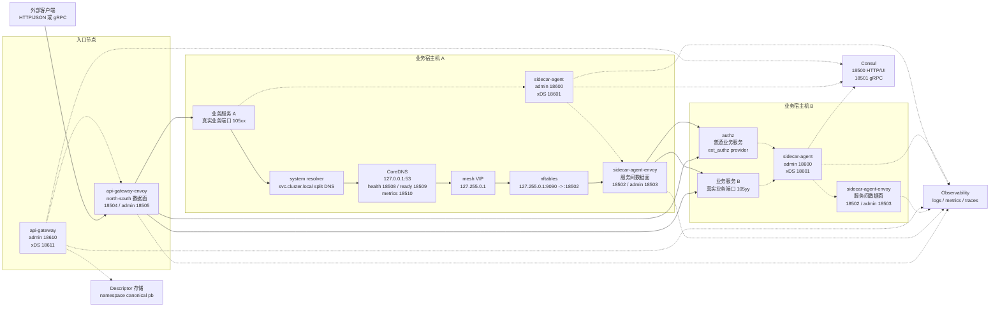

# 流量拓扑

本文描述 Firefly 裸机 / IDC 部署中 `sidecar-agent`、`api-gateway`、两个 Envoy、CoreDNS 和 nftables 的运行边界。实线表示请求数据面，虚线表示注册、watch、descriptor、xDS 或观测链路。

## 完整拓扑图

下图是文档站可直接显示的静态拓扑图；后面的 Mermaid 源码用于维护和复制。


### Mermaid 源码



## 组件职责

| 组件 | 职责 | 不负责 |
| :--- | :--- | :--- |
| `sidecar-agent` | 本机控制面；接收业务服务 register / drain / deregister，写入 Consul service、health 和 route document，生成 `sidecar-agent-envoy` xDS | 业务流量转发、DNS server、透明代理、north-south 入口 |
| `sidecar-agent-envoy` | 本机服务间数据面入口；监听 `18502`，执行路由、负载均衡、retry、ext_authz，并转发到真实业务端口 `105xx` | 服务注册、Consul 写入、xDS 编译、DNS |
| `api-gateway` | north-south 控制面；watch Consul route / health / descriptor current，拉取 descriptor pb，生成 `api-gateway-envoy` xDS | 业务服务注册、签发 token、接口权限判定、托管 Envoy / Consul |
| `api-gateway-envoy` | north-south 数据面入口；监听 `18504`，承接外部 HTTP/JSON 和 gRPC，执行 ext_authz、转码和路由 | 控制面编译、服务注册、sidecar 数据面转发 |
| CoreDNS | 节点级 Service DNS；把 `*.svc.cluster.local` 解析到本机 mesh VIP `127.255.0.1` | 查 Consul、服务发现、负载均衡、端口改写、透明代理 |
| nftables | Linux 本机透明导流；把 mesh VIP 的逻辑服务端口导入 `sidecar-agent-envoy:18502` | DNS、服务发现、鉴权、路由编译 |

`api-gateway-envoy` 和 `sidecar-agent-envoy` 是并列的数据面入口：前者服务外部入口流量，后者服务本机服务间调用。二者不是主从关系，也不是常规数据面串联关系。

## North-South 链路

外部入口只进入 `api-gateway-envoy:18504`：

```text
外部客户端
  -> api-gateway-envoy:18504
  -> ext_authz 调用 authz 普通服务
  -> HTTP/JSON 转 gRPC 或原生 gRPC route
  -> 目标业务服务真实端口 105xx
```

`api-gateway` 从 Consul 读取健康 endpoint、route document 和 `{namespace}/api-gateway/descriptor/current`，再通过 `18611` 向 `api-gateway-envoy` 下发 ADS / xDS。`api-gateway-envoy` 的 Docker bootstrap 只包含连接 xDS 控制面的静态 cluster，默认连宿主机 `host.docker.internal:18611`。

`api-gateway-envoy` 的 Compose 端口约定：

| 宿主端口 | 容器端口 | 用途 |
| :--- | :--- | :--- |
| `18504` | `18504` | north-south HTTP/gRPC 数据面入口 |
| `18505` | `19000` | Envoy admin |

gRPC-JSON transcoder 需要读取 `api-gateway` 拉取的 descriptor 文件；Compose 会把宿主机上的 `descriptor.dir`，例如 `/opt/firefly/descriptor`，按相同路径只读挂入容器。

## Service-to-Service 链路

业务服务之间的标准裸机链路是：

```text
业务服务 A
  -> auth.lhdht.svc.cluster.local:9090
  -> 系统 resolver
  -> CoreDNS:53
  -> 127.255.0.1:9090
  -> nftables redirect
  -> 127.0.0.1:18502
  -> sidecar-agent-envoy
  -> ext_authz 调用 authz 普通服务
  -> 业务服务 B 真实端口 105yy
```

这里有三层端口语义：

| 地址或端口 | 语义 |
| :--- | :--- |
| `service.namespace.svc.cluster.local:9090` | 业务调用契约；`9090` 是逻辑服务端口，用于 authority 和路由匹配 |
| `127.255.0.1:9090` | CoreDNS 返回的本机 mesh VIP 加逻辑端口 |
| `127.0.0.1:18502` | 本机 `sidecar-agent-envoy` 数据面入口 |
| `192.168.x.x:105xx` | Consul / EDS 中的真实业务实例端口 |

`sidecar-agent-envoy` 的 Compose 端口约定：

| 宿主端口 | 容器端口 | 用途 |
| :--- | :--- | :--- |
| `18502` | `18502` | 服务间数据面入口 |
| `18503` | `19000` | Envoy admin |

它的 Envoy `node.id` 必须与 `sidecar-agent` bootstrap 中的 `xds.node_id` 一致，当前为 `sidecar-agent-envoy`；xDS 静态 cluster 默认连接宿主机 `host.docker.internal:18601`。

## CoreDNS 与 nftables

CoreDNS 是每台业务宿主机上的节点级基础设施，不作为局域网共享 DNS。当前 Corefile 的关键逻辑是把 mesh 域名固定解析到 `127.255.0.1`：

```text
template IN A svc.cluster.local {
    match ^(.+)\.svc\.cluster\.local\.$
    answer "{{ .Name }} 30 IN A 127.255.0.1"
    fallthrough
}
```

CoreDNS Docker 端口约定：

| 宿主端口 | 容器端口 | 用途 |
| :--- | :--- | :--- |
| `127.0.0.1:53/udp` | `53/udp` | 节点级 Service DNS |
| `127.0.0.1:53/tcp` | `53/tcp` | 节点级 Service DNS |
| `127.0.0.1:18508` | `8080` | health |
| `127.0.0.1:18509` | `8181` | ready |
| `18510` | `9153` | Prometheus metrics |

Linux 正式裸机口径使用 nftables 做透明导流：

```text
table ip firefly_mesh {
  chain output {
    type nat hook output priority -101; policy accept;
    ip daddr 127.255.0.1 tcp dport 9090 counter redirect to :18502
  }
}
```

如果同机存在多个逻辑服务端口，可以把 `dport` 扩展为集合，例如 `{ 9090, 9443 }`。规则应只匹配 Firefly mesh VIP 和逻辑服务端口，避免误伤 Consul、CoreDNS、Envoy admin、控制面 admin、真实业务端口和普通本机回环流量。

## 常用排障

| 目标 | 命令 |
| :--- | :--- |
| CoreDNS 是否能回答 mesh 域名 | `dig @127.0.0.1 auth.lhdht.svc.cluster.local A +short` |
| 系统 resolver 是否接入 split DNS | `resolvectl query auth.lhdht.svc.cluster.local` |
| nftables 规则是否存在 | `sudo nft list table ip firefly_mesh` |
| 绕过 resolver 验证透明导流 | `nc -vz 127.255.0.1 9090` |
| 验证服务间 Envoy listener | `curl -s http://127.0.0.1:18503/listeners` |
| 验证入口 Envoy listener | `curl -s http://127.0.0.1:18505/listeners` |
| 查看 `sidecar-agent` xDS | `curl -s http://127.0.0.1:18600/debug/xds` |
| 查看 `api-gateway` xDS | `curl -s http://127.0.0.1:18610/debug/xds` |
| 查看 CoreDNS metrics | `curl -fsS http://127.0.0.1:18510/metrics` |

如果 `dig @127.0.0.1 ...` 正常但 FQDN 直连失败，优先检查系统 resolver 是否把 `svc.cluster.local` 接到了本机 CoreDNS。如果 `nc -vz 127.255.0.1 9090` 失败，优先检查 nftables 规则、`sidecar-agent-envoy` listener 和 `sidecar-agent` xDS 状态。
