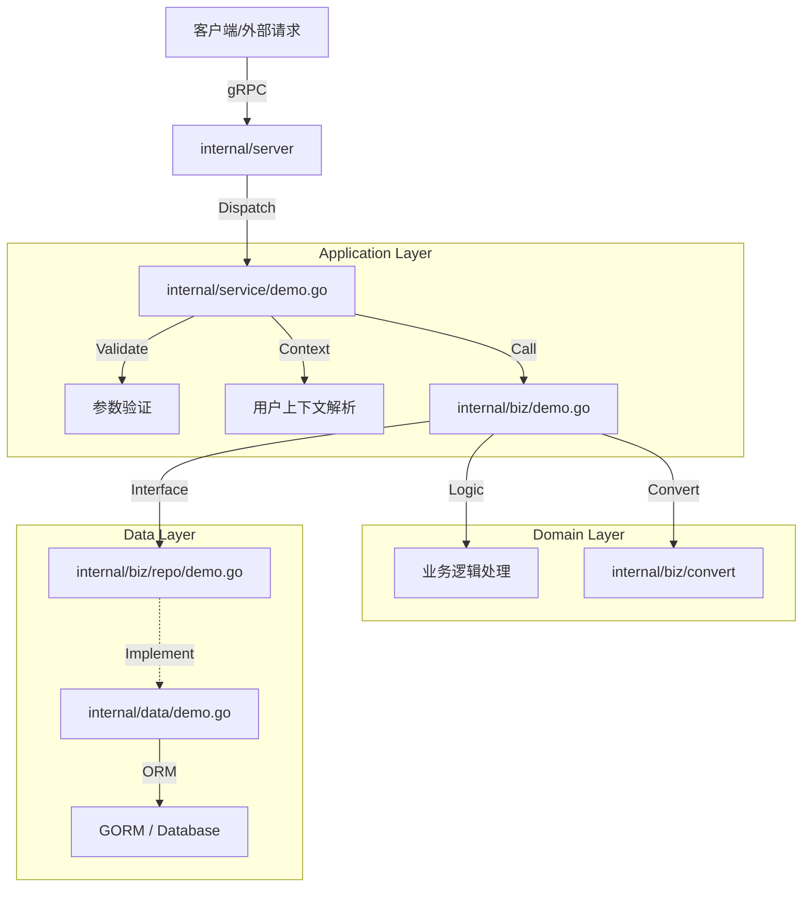

# 数据流转详解

本文档以模板中的 `Demo` 模块为例，详细解析 `go-layout` 中一次完整请求的数据流转过程。通过追踪代码执行路径，帮助你理解各层级如何协作。

## 整体架构流向图



## 场景一：创建数据 (Write Path)
以 `CreateDemo` 接口为例，展示数据从 API 到数据库的写入流程。

### 1. Service 层 (入口)
**文件**: `internal/service/demo.go`
**方法**: `CreateDemo`

```go
func (srv *DemoService) CreateDemo(ctx context.Context, request *pb.CreateDemoRequest) (*pb.CreateDemoResponse, error) {
    // 1. 参数验证 (基于 Proto 定义的规则)
    if err := protovalidate.Validate(request); err != nil { ... }

    // 2. 获取用户上下文 (租户ID, 用户ID等)
    md, _ := metadata.FromIncomingContext(ctx)
    um, err := rpc.ParseUserContextMeta(md)

    // 3. 调用业务逻辑
    if err = srv.uc.CreateDemo(ctx, um, request); err != nil { ... }
    
    return result, nil
}
```

### 2. Biz 层 (业务编排)
**文件**: `internal/biz/demo.go`
**方法**: `CreateDemo`

```go
func (uc *DemoUseCase) CreateDemo(ctx context.Context, um *rpc.UserContextMeta, request *pb.CreateDemoRequest) error {
    // 1. 数据转换: DTO (Request) -> PO (Entity)
    // 使用定义在 internal/biz/convert/demo.go 的接口，由 goverter 生成实现
    row := uc.dto.ToCreate(request)
    
    // 2. 填充业务字段 (如审计信息)
    row.AppId = um.AppId
    row.UserId = um.UserId
    row.TenantId = um.TenantId

    // 3. 调用 Repo 接口保存
    return uc.repo.CreateDemo(ctx, row)
}
```

### 3. Data 层 (持久化)
**文件**: `internal/data/demo.go`
**方法**: `CreateDemo`

```go
func (uc *demoRepo) CreateDemo(ctx context.Context, row *entity.Demo) error {
    // 1. 执行数据库操作 (GORM)
    // entity.Demo 映射了数据库表结构
    return uc.data.db.WithContext(ctx).Create(row).Error
}
```

---

## 场景二：查询列表 (Read Path - 性能优化)
以 `GetDemoList` 接口为例，展示 **DTO 穿透** 模式。为了查询性能，我们允许 Data 层直接构建并返回 DTO，跳过不必要的 PO -> DO -> DTO 转换。

### 1. Service 层
**文件**: `internal/service/demo.go`
**方法**: `GetDemoList`

```go
func (srv *DemoService) GetDemoList(...) {
    // ... 验证与上下文提取 ...
    // 直接返回 Biz 层提供的结果
    result.Data = srv.uc.GetDemoList(ctx, um, request)
    return result, nil
}
```

### 2. Biz 层
**文件**: `internal/biz/demo.go`
**方法**: `GetDemoList`

```go
func (uc *DemoUseCase) GetDemoList(ctx context.Context, um *rpc.UserContextMeta, request *pb.GetDemoListRequest) *pb.DemoList {
    // 纯查询操作，无复杂业务逻辑，直接透传调用 Repo
    return uc.repo.GetDemoList(ctx, um, request)
}
```

### 3. Data 层
**文件**: `internal/data/demo.go`
**方法**: `GetDemoList`

```go
func (uc *demoRepo) GetDemoList(ctx context.Context, um *rpc.UserContextMeta, request *pb.GetDemoListRequest) *pb.DemoList {
    var raw pb.DemoList // 直接使用 Proto 定义的 DTO 作为结果集容器

    // 构建查询
    sql := uc.data.db.WithContext(ctx).Model(&entity.Demo{})
    // ... Where 条件 ...
    
    // 执行查询，GORM 会自动将结果映射到 raw.List 中
    // 注意：这里利用了 GORM 的智能映射或需要确保字段名兼容
    sql.Find(&raw.List)

    return &raw
}
```

## 关键代码设计点

1.  **接口隔离**：Biz 层只依赖 `repo.DemoRepo` 接口（定义在 `internal/biz/repo`），不依赖 `internal/data` 的具体实现。这使得单元测试时可以轻松 Mock Repo。
2.  **转换器 (Converter)**：`uc.dto.ToCreate` 是通过 `goverter` 自动生成的。在 `internal/biz/convert/demo.go` 中定义接口，生成的代码位于 `dep/dto/`。这避免了手写繁琐的 struct 赋值代码。
3.  **读写分离策略**：
    *   **写入**：严格经过 PO 转换，确保数据完整性和约束。
    *   **读取**：灵活处理，允许直接返回 DTO 以减少对象拷贝开销，特别是在列表查询场景。
