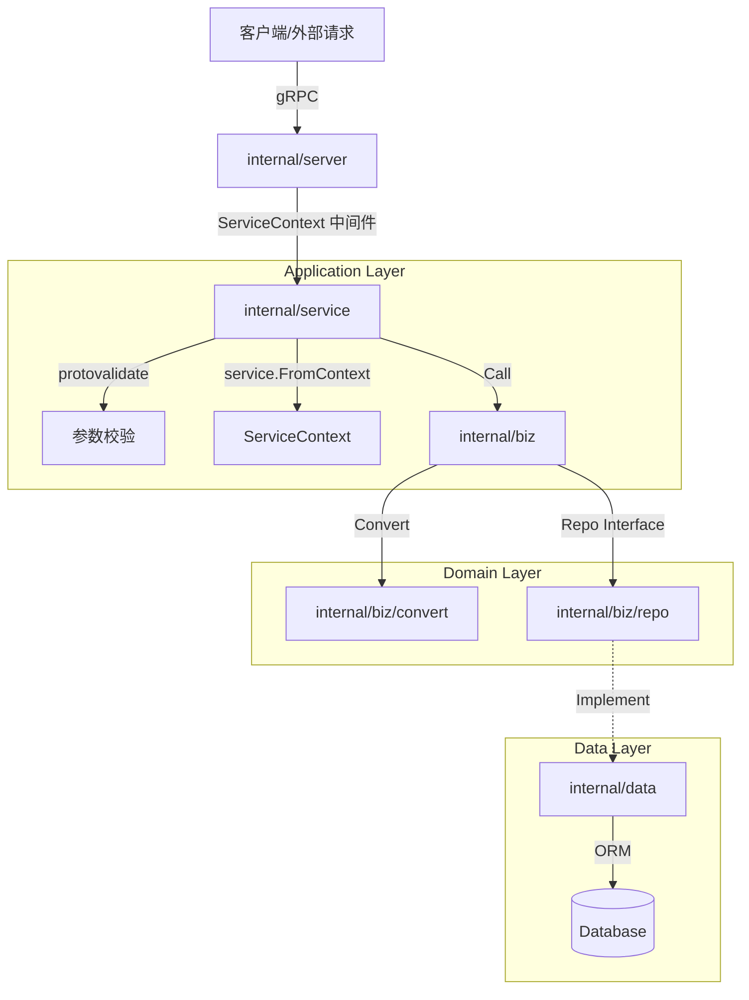

# 数据流转详解

本文档以模板中的 `Demo` 模块为例，说明一次 gRPC 请求如何在 `Server -> Service -> Biz -> Data` 之间流转。

## 整体流向


```mermaid
graph TD
    Client[客户端/外部请求] -->|gRPC| Server[internal/server]
    Server -->|ServiceContext 中间件| Service[internal/service]

    subgraph "Application Layer"
    Service -->|protovalidate| Validate[参数校验]
    Service -->|service.FromContext| Context[ServiceContext]
    Service -->|Call| Biz[internal/biz]
    end

    subgraph "Domain Layer"
    Biz -->|Convert| Convert[internal/biz/convert]
    Biz -->|Repo Interface| RepoInterface[internal/biz/repo]
    end

    subgraph "Data Layer"
    RepoInterface -.->|Implement| RepoImpl[internal/data]
    RepoImpl -->|ORM| DB[(Database)]
    end
```

## 场景一：创建数据

### 1. Service 层

Service 层负责入口校验和读取服务上下文。

```go
func (srv *DemoService) CreateDemo(ctx context.Context, request *pb.CreateDemoRequest) (*pb.CreateDemoResponse, error) {
    if err := protovalidate.Validate(request); err != nil {
        return nil, err
    }

    sc, ok := service.FromContext(ctx)
    if !ok {
        return nil, errors.New("service context not found")
    }

    if err := srv.uc.CreateDemo(ctx, sc, request); err != nil {
        return nil, err
    }

    return &pb.CreateDemoResponse{}, nil
}
```

注意：

- Service 层不再手工解析 gRPC metadata。
- `service.Context` 由 `gm.NewServiceContextUnaryInterceptor` 在 gRPC 入口注入。

### 2. Biz 层

Biz 层负责编排业务逻辑。

```go
func (uc *DemoUseCase) CreateDemo(ctx context.Context, sc *service.Context, request *pb.CreateDemoRequest) error {
    row := uc.dto.ToCreate(request)
    row.AppId = sc.AppId
    row.UserId = sc.UserId
    row.TenantId = sc.TenantId

    return uc.repo.CreateDemo(ctx, row)
}
```

### 3. Data 层

Data 层负责持久化。

```go
func (r *demoRepo) CreateDemo(ctx context.Context, row *entity.Demo) error {
    return r.data.db.WithContext(ctx).Create(row).Error
}
```

## 场景二：查询列表

列表查询允许 Data 层直接构造 Proto DTO，减少不必要的对象转换。

```go
func (r *demoRepo) GetDemoList(ctx context.Context, sc *service.Context, request *pb.GetDemoListRequest) *pb.GetDemoListResponse {
    var raw pb.GetDemoListResponse

    sql := r.data.db.WithContext(ctx).Model(&entity.Demo{})
    sql.Where("user_id = ?", sc.UserId)
    sql.Where("app_id = ?", sc.AppId)
    sql.Count(&raw.Total)
    sql.Scopes(scope.WithPagination(request.Page, request.PageSize))
    sql.Find(&raw.List)

    return &raw
}
```

## 场景三：事务

复杂业务可以通过事务接口解耦 Biz 与 GORM 实现。

Biz 层定义接口：

```go
type Transaction interface {
    ExecTx(ctx context.Context, fn func(ctx context.Context) error) error
}
```

Data 层实现：

```go
func (r *transaction) ExecTx(ctx context.Context, fn func(ctx context.Context) error) error {
    return r.data.db.WithContext(ctx).Transaction(func(tx *gorm.DB) error {
        txCtx := context.WithValue(ctx, repo.TransactionContextKey, tx)
        return fn(txCtx)
    })
}
```

Repo 方法如需支持事务，可从 context 中取出事务 DB；没有事务时使用默认 DB。

## 关键规则

1. Service 层负责 `protovalidate.Validate(req)`。
2. Service 层读取 `go-micro/service.Context`。
3. Biz 层不依赖具体 Data 实现。
4. Data 层所有 DB 操作应使用传入的 `ctx`。
5. 出站远程调用由 `go-micro/invocation` 复用当前 context metadata，不从 `ServiceContext` 反向拼装出站 metadata。
