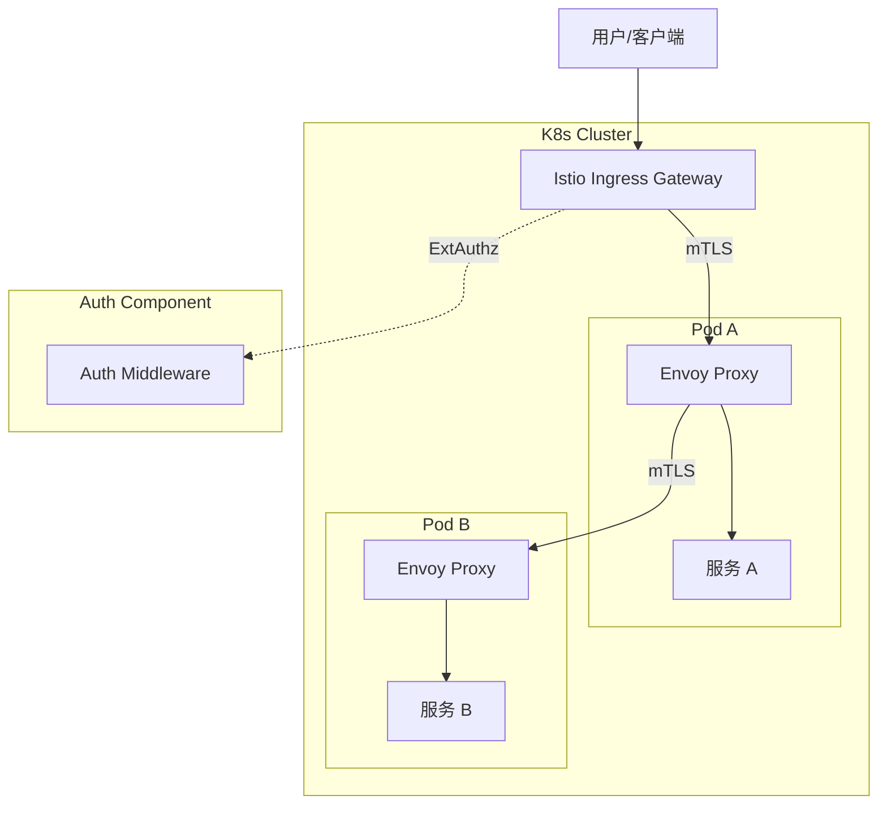

# 技术架构

Firefly 提供了一套完整的微服务技术栈，涵盖了从网关到存储的各个环节。

## 架构全景图

### 模式一：自研网关模式 (Standard Mode)

适用于中小型规模集群，或非 K8s 环境。核心特点是使用 Firefly 自研的网关组件处理所有南北向流量。

**优势**：
- **极简运维**：除业务服务外，仅需维护一个 **Etcd** 集群。相比传统微服务方案，省去了 Config Server, Eureka, Hystrix Dashboard 等繁杂组件。
- **资源占用低**：网关与服务均基于高性能语言（Go/Rust）构建，启动快，内存占用少。
- **快速落地**：开箱即用的鉴权与流控能力，无需深入学习 Service Mesh 即可获得微服务治理能力。

```mermaid
graph TD
    User[用户/客户端] --> HTTP_GW[HTTP Gateway]
    User --> GRPC_GW[gRPC Gateway]
    
    HTTP_GW -->|转发| GRPC_GW
    
    subgraph "Service Mesh (Logical)"
        GRPC_GW -->|gRPC + LB + Auth| ServiceA[服务 A]
        GRPC_GW -->|gRPC + LB + Auth| ServiceB[服务 B]
    end
    
    subgraph Infrastructure
        Registry[Etcd (注册/配置)]
    end
    
    GRPC_GW --> Registry
    ServiceA --> Registry
    ServiceB --> Registry
    ServiceA --> ServiceB
```

- **HTTP Gateway**: 负责将外部 HTTP/RESTful 请求转换为 gRPC 请求，转发给 gRPC Gateway。不包含复杂业务逻辑。
- **gRPC Gateway**: 核心网关。负责所有服务的**负载均衡**、**权限检查**、**鉴权**（调用 Auth 服务）、**熔断**、**限流**。
- **Service**: 业务服务本身**不做**负载均衡、鉴权等网关逻辑，专注于业务。

### 模式二：K8s + Istio 模式 (Enterprise Mode)

适用于大规模容器化集群。核心特点是将网关能力下沉到 Sidecar/Ingress，业务服务与自研网关解耦。



- **去中心化**：不再使用自研的 HTTP/gRPC Gateway 组件。
- **能力下沉**：负载均衡、熔断、限流由 **Istio/Envoy** 接管。
- **鉴权适配**：原有的鉴权逻辑（在 gRPC Gateway 中）被抽离为独立的**旁路中间件**（如适配 Istio External Authorization），与 Service Mesh 配合使用。
- **无缝切换**：由于 Firefly 的 Service 设计天然不包含网关逻辑，因此从“自研网关模式”迁移到“Istio 模式”时，业务代码几乎无需修改。

## 核心组件

### 1. 通信协议
-   **内部通信**：默认使用 **gRPC**。它基于 HTTP/2，性能高效，支持双向流，且有完善的 IDL (Protobuf) 支持。
-   **外部接口**：支持通过 gRPC-Gateway 或自定义 HTTP Server 暴露 RESTful API。

### 2. 服务治理
-   **注册与发现**：默认集成 **Etcd**。服务启动时自动注册节点信息，调用方通过客户端负载均衡器获取健康节点。
-   **负载均衡**：客户端侧负载均衡（Client-side LB），支持轮询、加权轮询等策略。
-   **熔断与限流**：集成常用的熔断器和限流器，保护服务免受雪崩效应影响。

### 3. 配置管理
-   **引导配置**：本地 `bootstrap.json` 定义服务的基础属性（环境、端口、配置中心地址）。
-   **动态配置**：支持从配置中心（如 Etcd）动态加载业务配置，无需重启服务即可调整参数。

### 4. 数据存储
-   **ORM**：Go 版本默认集成 **GORM**，支持 MySQL, PostgreSQL, SQLite 等主流数据库。
-   **Cache**：默认集成 **go-redis**，提供高性能的缓存支持。
-   **数据转换**：集成 **Goverter**，在编译期生成 DTO 与 Entity 之间的高性能转换代码。

### 5. 开发工具链
-   **Buf**：现代化的 Protobuf 管理工具，用于 lint、格式化和生成代码。
-   **Wire**：Go 语言的编译期依赖注入工具。
-   **Protovalidate**：基于 Protobuf 选项的参数校验框架，自动生成校验逻辑。

## 多语言支持策略

Firefly 的核心架构是语言无关的。只要遵循相同的协议标准，不同语言实现的服务可以无缝协作。

-   **Go**: `go-layout` (Stable) - 官方推荐的生产级实现。
-   **Rust**: (Planning) - 面向对性能和内存安全有极致要求的场景。
-   **Node.js / Python**: (Planning) - 面向快速开发和脚本胶水层。
