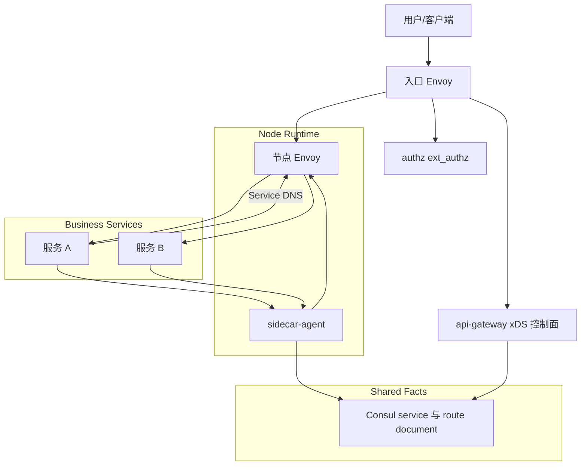
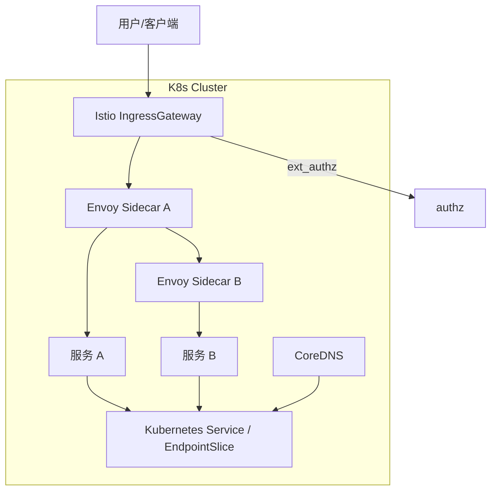

# 技术架构

Firefly 的当前主线围绕 Go 业务服务模板、协议生成、裸机运行时和云原生目标态组织。业务服务保持轻量分层，注册、发现、路由、鉴权和流量治理逐步交给运行时组件承接。

## 架构全景图

### 模式一：裸机运行时模式

适用于中小型规模集群、IDC 或暂未进入 K8s 的环境。核心特点是业务服务通过 `go-consul/agent` 接入本机 `sidecar-agent`，由 Envoy、Consul、api-gateway 和 authz 承接治理能力。

```mermaid
graph TD
    User[用户/客户端] --> EntryEnvoy[入口 Envoy]
    EntryEnvoy --> ApiGateway[api-gateway xDS 控制面]
    EntryEnvoy --> Authz[authz ext_authz]
    EntryEnvoy --> NodeEnvoy[节点 Envoy]

    subgraph "Node Runtime"
        Agent[sidecar-agent]
        NodeEnvoy
    end

    subgraph "Business Services"
        ServiceA[服务 A]
        ServiceB[服务 B]
    end

    subgraph "Shared Facts"
        Consul[Consul service 与 route document]
    end

    ServiceA --> Agent
    ServiceB --> Agent
    Agent --> Consul
    ApiGateway --> Consul
    Agent --> NodeEnvoy
    NodeEnvoy --> ServiceA
    NodeEnvoy --> ServiceB
    ServiceA -->|Service DNS| NodeEnvoy
```

关键职责：

- `go-layout`：业务服务模板，负责 Service / Biz / Data 分层、启动配置、gRPC 入口和 management 端口。
- `go-consul/agent`：业务进程内接入库，读取 `gateway.manifest.json` 并对接本机 `sidecar-agent`。
- `sidecar-agent`：本机控制面，负责注册、摘流、注销、watch/replay、route document、东西向 xDS、DNS 和健康探测。
- `api-gateway`：north-south 入口控制面，消费 Consul route document、endpoint 和 `descriptor_ref`，生成入口 Envoy xDS。
- `authz`：标准 Envoy ext_authz 数据面授权服务，执行身份校验和 Casbin 判定。
- `Envoy`：承载入口路由、转码、鉴权、东西向路由和负载能力。

### 模式二：K8s + Istio 模式

适用于大规模容器化集群。目标是让服务注册、发现、负载和治理由 Kubernetes 与 Istio / Envoy 承接，业务代码继续保持同一套 Service / Biz / Data 分层和 `go-micro/service.Context`。

```mermaid
graph TD
    User[用户/客户端] --> IstioIngress[Istio IngressGateway]
    IstioIngress -->|ext_authz| Authz[authz]

    subgraph "K8s Cluster"
        IstioIngress --> SidecarA[Envoy Sidecar A]
        SidecarA --> ServiceA[服务 A]
        SidecarA --> SidecarB[Envoy Sidecar B]
        SidecarB --> ServiceB[服务 B]
        K8sService[Kubernetes Service / EndpointSlice]
        CoreDNS[CoreDNS]
    end

    ServiceA --> K8sService
    ServiceB --> K8sService
    CoreDNS --> K8sService
```

迁移原则：

- 业务服务不恢复注册中心 SDK、实例发现或负载均衡逻辑。
- 鉴权继续使用 Envoy ext_authz 与 Firefly authority 头。
- 配置数据面按环境选择实现：裸机用 `go-consul/config`，K8s 用 `go-k8s/config`。
- manifest 与 descriptor 继续作为接口事实、转码和治理输入。

## 核心组件

### 1. 通信协议

- **内部通信**：默认使用 gRPC。
- **外部入口**：裸机场景由 `api-gateway + Envoy` 承接 HTTP/JSON 到 gRPC 转码；云原生场景可映射到 Istio IngressGateway 和 Envoy 能力。
- **接口契约**：以 Protobuf 为单一事实来源，Buf 负责代码生成，`protoc-gen-gateway-manifest` 负责生成 `gateway.manifest.json`。

### 2. 服务治理

- **服务注册**：裸机由 `go-consul/agent -> sidecar-agent -> Consul` 承接；云原生由 Kubernetes Service / EndpointSlice 承接。
- **服务发现**：业务代码只表达目标 Service DNS，不直接做实例发现。
- **路由与负载**：由 Envoy / Istio 等运行时数据面承接。
- **鉴权**：由 authz 数据面执行，业务服务可在显式配置后本地验签 `x-firefly-authz-sign`。

### 3. 配置管理

- **引导配置**：本地 `bootstrap.json` 定义服务身份、业务端口、management 端口、sidecar-agent、logger 和 telemetry。
- **运行期配置**：业务服务通过 `go-micro/config.Store` 读取当前生效配置；裸机 / IDC 默认由 Consul 适配层实现。
- **控制面边界**：Config 服务负责发布、版本、回滚、审计和治理，不作为业务服务高频配置读取代理。

### 4. 可观测性

- Trace 主线使用 OTel / W3C Trace Context。
- 默认传播 `traceparent`、`tracestate` 和 `baggage`。
- `x-request-id` 只作为 Envoy 或日志关联 ID，不作为业务 trace 主链路。

### 5. 开发工具链

- **Buf**：Protobuf 管理、lint、breaking check 和代码生成。
- **protoc-gen-gateway-manifest**：从 proto descriptor 生成 Firefly route manifest。
- **Wire**：Go 编译期依赖注入。
- **Goverter**：编译期生成 DTO / Entity 转换代码。
- **Protovalidate**：基于 Protobuf 选项的参数校验。

## 多语言支持策略

Firefly 的核心架构是语言无关的。只要遵循相同的协议标准，不同语言实现的服务可以通过 gRPC、Firefly authority 和运行时治理能力协作。

| 语言 | 状态 | 说明 |
| :--- | :--- | :--- |
| Go | Stable | `go-layout` 是当前官方推荐的生产级模板。 |
| Rust / Node.js / Python 等 | Planning | 后续围绕相同协议和运行时契约推进。 |
